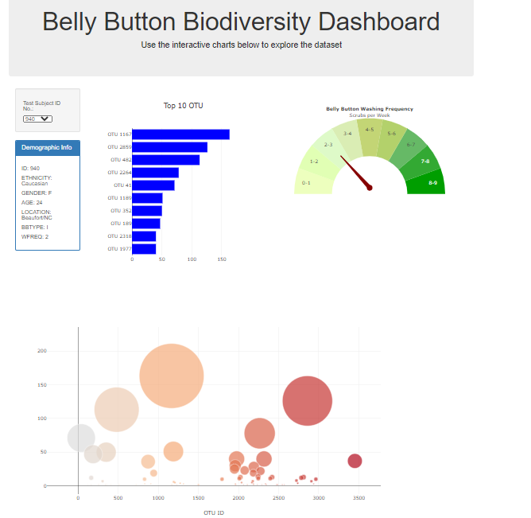

# Belly-Button-BioDiversity

Develop a dashboard for users to enter their research id to see a dashboard that reflects their demographic info, washing frequency, and relative frequency of all the bacterial species found in a volunteer’s navel.

